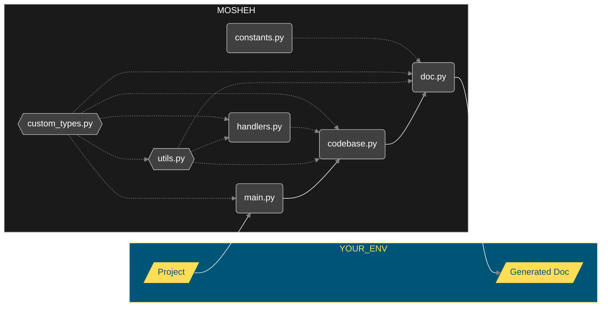

<h1 align="center">
  
  <br>
  Mosheh
</h1>


<!--  -->

Mosheh é um script para geração de documentações de projetos, de Python para Python.

Basicamente, Mosheh lista todos os arquivos para onde você apontar, armazena cada declaração de definição notória em cada arquivo varrido através da manipulação da AST com o módulo `ast` e, posteriormente, gera a documentação - com uso de [MkDocs](https://www.mkdocs.org/) e [Material MkDocs](https://squidfunk.github.io/mkdocs-material/) - respeitando os dados obtidos e a hierarquia dos diretórios e arquivos.

Os elementos documentados para cada arquivo estão listados abaixo:

- Importações `[ast.Import | ast.ImportFrom]`

  - [x] Tipo `[Nativo | Terceiros | Local]`
  - [x] Path (e.g. '`django.http`')

- Constantes `[ast.Assign | ast.AnnAssign]`

  - [x] Nome do Token
  - [x] Anotação de Tipo (datatype)
  - [x] Valor (um literal, uma operação ou uma chamada)

- Classes `[ast.ClassDef]`

  - [ ] Descrição (docstring)
  - [x] Nome (nome da classe)
  - [x] Pais (heranças)
  - [ ] Métodos Definidos (quantidade e nomes)
  - [ ] Examplo de Uso

- Funções `[ast.FunctionDef | ast.AsyncFunctionDef]`

  - [ ] Descrição (docstring)
  - [x] Nome (nome da função)
  - [ ] Tipo `[Func | Método | Gerador | Corrotina]`
  - [x] Parâmetros (nome, tipo e valor padrão)
  - [x] Tipo de Retorno (datatype)
  - [ ] Exceções (disparo de erros)
  - [ ] Examplo de Uso

- Asserções: `[ast.Assert]`
  - [x] Teste (asserção)
  - [x] Mensagem (opcional, caso falhe)

## Stack


## Arquitetura

A arquitetura do Mosheh pode ser interpretada a partir de duas formas: a estrutura de diretórios e a interação dos elementos que o compõem. Parte considerável de um projeto é - ou ao menos deveria ser - elementos dispensáveis para sua funcionalidade, de fato, como por exemplo a existência de testes automatizados; eles são importantes para que todo e qualquer processo de qualidade existente seja mantido a um nível mínimo aceitável, mas se todos os testes forem apagados, a ferramenta continua funcionando ainda assim.

Aqui não é diferente, uma parte considerável do Mosheh é, na verdade, completamente dispensável; acompanhe abaixo a estrutura de diretórios e arquivos relevantes que fazem parte deste projeto:

```sh
.
├── mosheh                      # O código-fonte o próprio Mosheh
│   ├── codebase.py             # Lógica de leitura da base de código
│   ├── constants.py            # Constantes a serem avaliadas
│   ├── custom_types.py         # Tipos de dados próprios
│   ├── doc.py                  # Lógica de construção da documentação final
│   ├── handlers.py             # Funções de manipulação de nós da base de código
│   ├── main.py                 # Arquivo de entrada
│   └── utils.py                # Códigos utilitários, como Busca Binária
│
├── tests                       # Diretório de gabarito para testes
│   ├── DOC                     # Saída da documentação gerada
│   └── PROJECT                 # Projeto de exemplo para teste
│
├── requirements.txt            # Depencências do Mosheh
│
├── .github                     # Tralhas sociais e workflows
│
├── LICENSE                     # Tralha legal, A.K.A não me processe
│
├── ruff.toml                   # Arquivo config do formatador Ruff
│
└── .gitignore                  # Arquivo "exclude" do Git
```

É de se esperar que caso aconteça do diretório `tests/` ser excluído, o Mosheh em si não sofrer alteração alguma, tanto que quando se baixa uma ferramenta via `pip` ou semelhantes, a ferramenta não vem acompanhada dos testes, licenças, arquivos de configuração de desenvolvimento ou workflows. Portanto, para contribuir com o entendimento do fluxo de funcionamento do diretório `mosheh/`, visualize a seguir como os elementos funcionais interagem entre si:



## Comandos e Parâmetros

### Comandos

A definir

### Parâmetros

|    Chamada     | Tipo  | Obrigatoriedade | Padrão | Exemplo                         | Ação                                   |
| :------------: | :---: | :-------------: | :----: | :------------------------------ | :------------------------------------- |
| `-h`, `--help` | `str` |   `Optional`    | `None` | `-h`, `--help`                  | Apresenta estes parâmetros de chamada  |
|    `-root`     | `str` |   `Required`    | `None` | `-root example/`                | Raíz, diretório base para o mapeamento |
| `--repo-name`  | `str` |   `Optional`    | `None` | `--repo-name toicin`            | Nome do repositório/projeto            |
|  `--repo-url`  | `str` |   `Optional`    | `None` | `--repo-url https://random.com` | Nome do repositório                    |
|    `--exit`    | `str` |   `Optional`    |  `.`   | `--exit doc/`                   | Caminho de saída da documentação       |

## Licença

This project is under [MIT License](https://choosealicense.com/licenses/mit/). A short and simple permissive license with conditions only requiring preservation of copyright and license notices. Licensed works, modifications, and larger works may be distributed under different terms and without source code.
